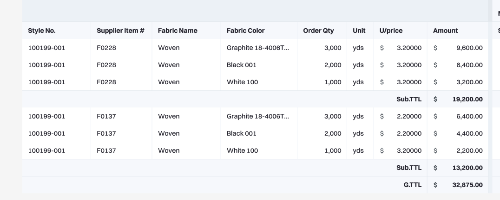
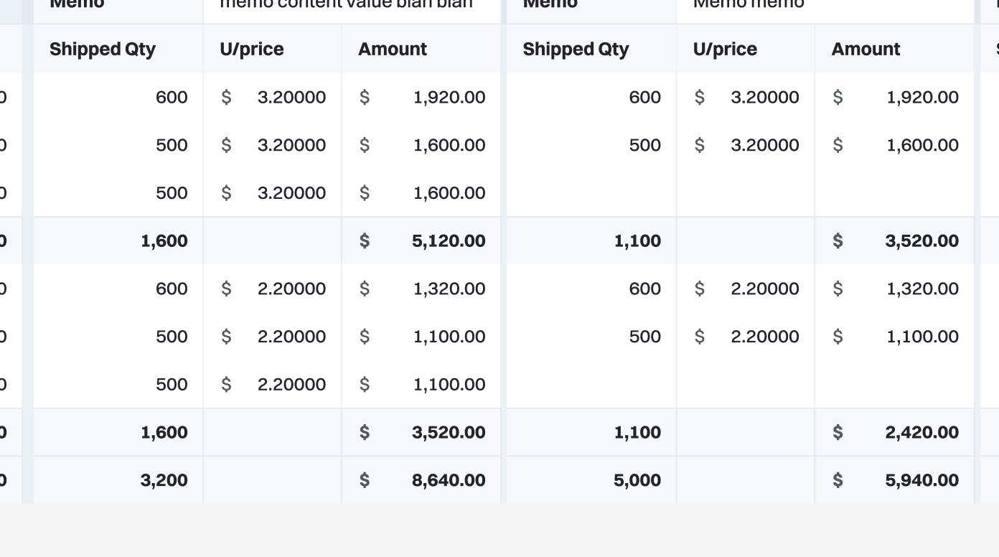

## 개요

Payment 테이블 UI를 구현하는 프론트엔드 과제입니다. 피그마와 제공된 Mock Data를 기반으로 화면을 완성하세요.

## 목표

- consumptions를 [salesOrder.id](http://salesOrder.id) 기준으로 그룹핑하고, 그룹별 Sub Total(= 해당 그룹의 orderAmount 합계)을 표시
- 컬럼별 검색 토글과 조건 선택으로 목록을 필터링
- payment, paymentBreakdowns와 consumptions 간 매핑을 화면에서 식별 가능하도록 표시

## 제출물

- Public GitHub 저장소 링크
- README 포함 내용
  - 요구사항 체크리스트
  - 실행 방법과 스크립트, 사용 버전(Node, npm 또는 pnpm 또는 yarn)
  - 폴더 구조 간략 설명
  - 주요 설계 의도와 트레이드오프 2~3개

## 기술 가이드

- React 필수
- 타입스크립트 필수
- 상태관리, 라우팅, 스타일링은 자유 선택
- 테이블 UI 라이브러리 사용 금지. 유틸리티(lodash, dayjs 등)는 허용

## 실행 요구

- 예: `npm install && npm dev`로 로컬 실행 가능해야 함

## 데이터 설명

- consumptions: 품목 단위. 그룹핑 키는 [salesOrder.id](http://salesOrder.id)
- payments: 결제 단위 데이터
- paymentBreakdowns: 특정 payment에 포함된 품목 및 수량 매핑. itemId = [consumption.id](http://consumption.id), paymentId = [payment.id](http://payment.id)

## 요구사항 상세

1. Sub Total
   - consumption을 [salesOrder.id](http://salesOrder.id)로 그룹핑
   - 각 그룹 하단에 Sub Total 행으로 orderAmount 합계 표시
2. 검색(Search)

   
   - 임의의 Search 토글 버튼 구현
   - Toggle ON 시 테이블 최상단에 "검색 행"(tr) 1줄 추가
   - 기본값은 All이며, 각 컬럼의 후보는 해당 컬럼의 consumption 고유값 집합
   - 선택 시 해당 조건과 일치하는 consumption만 표시
   - 다중 컬럼 동시 조건 AND

3. Mock Data는 다양한 상황을 표현하도록 수정 가능하나 스키마는 유지
4. CSS는 정확 일치 불필요. 피그마와 유사한 레이아웃과 상호작용 재현

## 피그마 링크

https://www.figma.com/design/5REZfeQehNzyvfg7SEM4F4/%EC%A0%9C%EB%AA%A9-%EC%97%86%EC%9D%8C?node-id=0-1&t=sPgRrebNrhtkv0ME-1

## 참고: 데이터 표시 위치

1. payment

   

2. consumption

   

3. payment breakdown. itemId = [consumption.id](http://consumption.id), paymentId = [payment.id](http://payment.id)

   

## Mock Data

- Mock Data

```json
{
  "payments": [
    {
      "id": 17,
      "paymentStatus": "NOT_YET",
      "paymentDueDate": "2025-10-14T00:00:00.000Z",
      "requestedAt": null,
      "pendingAt": null,
      "paidAt": null,
      "memo": null,
      "sourcingFiles": [],
      "financeFiles": []
    }
  ],
  "consumptions": [
    {
      "id": 294,
      "unitPrice": 4,
      "orderQuantity": 100,
      "orderAmount": 400,
      "fabricName": "Cotton",
      "fabricClass": "Solid",
      "fabricDetail": "Description",
      "supplierItemCode": "Supplier-0351",
      "brandItemCode": null,
      "colorName": "Lemon",
      "sopoNo": "PO_1",
      "unit": "yds",
      "garmentColorName": "Lemon",
      "garmentSize": { "id": 3, "name": "M", "orderNum": 4 },
      "salesOrder": {
        "id": 125,
        "styleNumber": "AIN26",
        "styleCode": "010",
        "createUser": {
          "id": 3,
          "name": "sije",
          "engName": "sije",
          "profileImage": "https://backendmonolis.s3.amazonaws.com/1756346915750/operator3.png"
        }
      }
    },
    {
      "id": 295,
      "unitPrice": 2,
      "orderQuantity": 822,
      "orderAmount": 1644,
      "fabricName": "Cotton",
      "fabricClass": "Solid",
      "fabricDetail": "Description",
      "supplierItemCode": "Supplier-0351",
      "brandItemCode": null,
      "colorName": "Salmon",
      "sopoNo": "PO_2",
      "unit": "yds",
      "garmentColorName": "Salmon",
      "garmentSize": { "id": 4, "name": "L", "orderNum": 5 },
      "salesOrder": {
        "id": 125,
        "styleNumber": "AIN26",
        "styleCode": "010",
        "createUser": {
          "id": 3,
          "name": "sije",
          "engName": "sije",
          "profileImage": "https://backendmonolis.s3.amazonaws.com/1756346915750/operator3.png"
        }
      }
    },
    {
      "id": 296,
      "unitPrice": 2,
      "orderQuantity": 400,
      "orderAmount": 800,
      "fabricName": "Cotton",
      "fabricClass": "Solid",
      "fabricDetail": "Description",
      "supplierItemCode": "Supplier-0351",
      "brandItemCode": null,
      "colorName": "Salmon",
      "sopoNo": "PO_2",
      "unit": "yds",
      "garmentColorName": "Salmon",
      "garmentSize": { "id": 2, "name": "S", "orderNum": 3 },
      "salesOrder": {
        "id": 125,
        "styleNumber": "AIN26",
        "styleCode": "010",
        "createUser": {
          "id": 3,
          "name": "sije",
          "engName": "sije",
          "profileImage": "https://backendmonolis.s3.amazonaws.com/1756346915750/operator3.png"
        }
      }
    },
    {
      "id": 297,
      "unitPrice": 3,
      "orderQuantity": 1000,
      "orderAmount": 3000,
      "fabricName": "Cotton",
      "fabricClass": "Solid",
      "fabricDetail": "Description",
      "supplierItemCode": "Supplier-0351",
      "brandItemCode": null,
      "colorName": "Salmon",
      "sopoNo": "PO_2",
      "unit": "yds",
      "garmentColorName": "Salmon",
      "garmentSize": { "id": 3, "name": "M", "orderNum": 4 },
      "salesOrder": {
        "id": 125,
        "styleNumber": "AIN26",
        "styleCode": "010",
        "createUser": {
          "id": 3,
          "name": "sije",
          "engName": "sije",
          "profileImage": "https://backendmonolis.s3.amazonaws.com/1756346915750/operator3.png"
        }
      }
    },
    {
      "id": 298,
      "unitPrice": 1,
      "orderQuantity": 100,
      "orderAmount": 100,
      "fabricName": "Cotton",
      "fabricClass": "Solid",
      "fabricDetail": "Description",
      "supplierItemCode": "Supplier-0351",
      "brandItemCode": null,
      "colorName": "Lemon",
      "sopoNo": "PO_1",
      "unit": "yds",
      "garmentColorName": "Lemon",
      "garmentSize": { "id": 2, "name": "S", "orderNum": 3 },
      "salesOrder": {
        "id": 125,
        "styleNumber": "AIN26",
        "styleCode": "010",
        "createUser": {
          "id": 3,
          "name": "sije",
          "engName": "sije",
          "profileImage": "https://backendmonolis.s3.amazonaws.com/1756346915750/operator3.png"
        }
      }
    },
    {
      "id": 299,
      "unitPrice": 6,
      "orderQuantity": 911,
      "orderAmount": 5466,
      "fabricName": "Cotton",
      "fabricClass": "Solid",
      "fabricDetail": "Description",
      "supplierItemCode": "Supplier-0351",
      "brandItemCode": null,
      "colorName": "Lemon",
      "sopoNo": "PO_1",
      "unit": "yds",
      "garmentColorName": "Lemon",
      "garmentSize": { "id": 4, "name": "L", "orderNum": 5 },
      "salesOrder": {
        "id": 125,
        "styleNumber": "AIN26",
        "styleCode": "010",
        "createUser": {
          "id": 3,
          "name": "sije",
          "engName": "sije",
          "profileImage": "https://backendmonolis.s3.amazonaws.com/1756346915750/operator3.png"
        }
      }
    }
  ],
  "paymentBreakdowns": [
    {
      "id": "b3cb76f3-c2bb-41ae-bf42-cf64a83655d5",
      "type": "ITEM",
      "shippedQuantity": 30,
      "unitPrice": 2,
      "amount": 60,
      "itemId": 294,
      "paymentId": 17
    },
    {
      "id": "9cc6b79a-bfac-4efc-af75-4c4fea71cd74",
      "type": "ITEM",
      "shippedQuantity": 10,
      "unitPrice": 0,
      "amount": 0,
      "itemId": 296,
      "paymentId": 17
    },
    {
      "id": "24d15e26-cf27-457a-a7f3-eb757d1d1c0f",
      "type": "ITEM",
      "shippedQuantity": 0,
      "unitPrice": 20,
      "amount": 0,
      "itemId": 298,
      "paymentId": 17
    },
    {
      "id": "10abf4dd-35d8-462c-9abb-97d2371769d7",
      "type": "ITEM",
      "shippedQuantity": 2,
      "unitPrice": 0,
      "amount": 0,
      "itemId": 299,
      "paymentId": 17
    }
  ]
}
```
